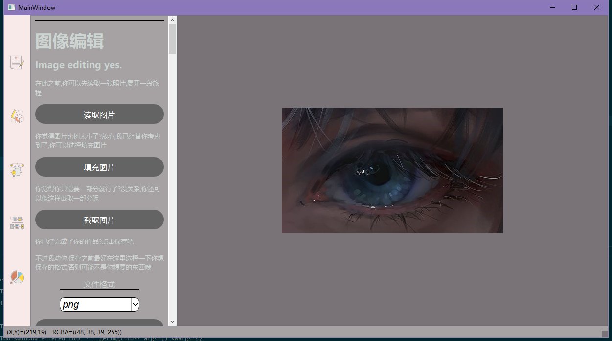
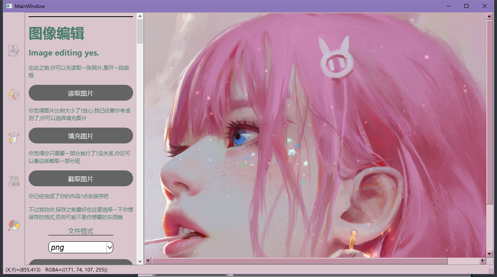

# PyQt - Digit Image Process

[](.)

***

本仓库包含以下内容：

1. 数字图像处理的一些知识
2. PyQt 可视化 处理图像平台

## 内容列表

- [更新](#更新)
- [背景](#背景)
- [安装](#安装)
- [示例](#示例)
- [相关仓库](#相关仓库)
- [维护者](#维护者)
- [如何贡献](#如何贡献)
- [使用许可](#使用许可)

## 更新

- 2021年5月4日16:28:05 第一次正式提交

## 背景

1. 两个星期狠无聊 找点事情给自己做
2. 顺便 把这门课的大作业做了?? 哈哈
3. 代码2000行下

## 安装

请确保你有安装

- numpy
- matplotlib
- pillow
- system_hotkey
- pyqt5

如果没有,直接pip 安装即可 推荐使用虚拟环境

```sh
git clone https://github.com/yujiecong/PyQt-Digit-Image-Process.git
```

如果你想直接用,可以去release看看

## 示例





## 相关仓库

- 无

## 维护者

[@yujiecong](https://github.com/yujiecong)。

## 如何贡献

非常欢迎你的加入！[提一个 Issue](./issues/new) 或者提交一个 Pull Request。


本 Readme 遵循 [Contributor Covenant](http://contributor-covenant.org/version/1/3/0/) 行为规范。

### 贡献者

感谢以下参与项目的人：  
<a href="graphs/contributors"></a>

## 使用许可

[MIT License](./blob/master/LICENSE)